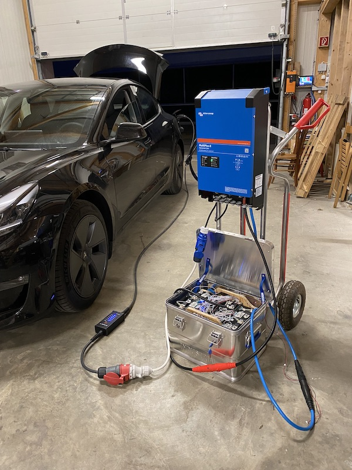

# LiFePO4_powerpack
Homemade mobile high power pack based on LiFePO4 batteries (Pack batterie mobile haute puissance fait maison basé sur des battteries LiFePO4)

## Presentation of concept

* [Présentation lors de la journée USKA de la radio de secours à Sugiez (en français)](battery_pack_public_fr.pdf)
* [Vortrag USKA Notfunk Tagung in Sugiez (en allemand, merci à HB9ALH pour la traduction)](battery_pack_public_de.pdf)

## Elements

### Battery

* [Basen LiFePO4 battery cells of 230Ah](https://www.basengreen.com/product/eve-230ah-lifepo4-battery/)

### BMS

* JBD BMD [AP21S001](https://jiabaidabms.com/products/jbd-smart-bms-8s-24v-100a-lithium-battery-protection-circuit-board-with-passive-balance-temp-sensor)

Other BMS under investigation for future packs: 123BMS, JK BMS, Seplos BMS (has CAN interface), homemade BMS

Objective is to interface it with the Victron Inverter. 
Project to test: https://github.com/Louisvdw/dbus-serialbattery 

### Inverter

* Inverter/Charger Victron Multiplus II 24/3000/70-32

This inverter is costly but is reliable with local suppliers for service if needed and it has many interfacing possibilities.

### Others

* Cabling is 50mm2, this may sound overkill but when using at constant high power, it reduces heat and so losses and voltage imprecisions.
* Cables are terminated with crimped pods , this is important to ensure good connections , avoid fires.

## Mounting

TBC
